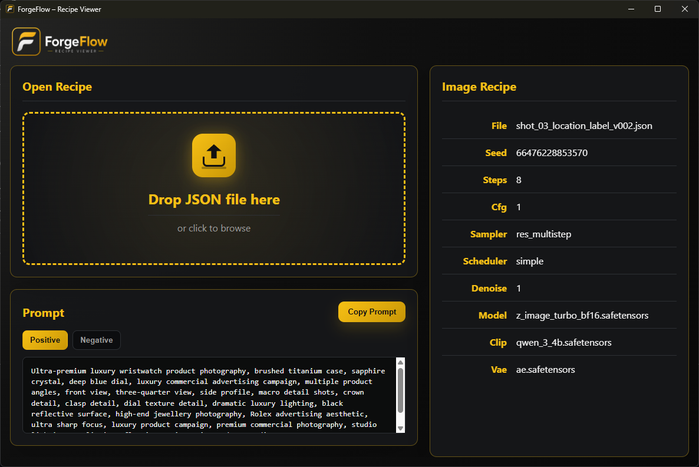

# ForgeFlow Recipe Viewer

ForgeFlow Recipe Viewer is a lightweight Electron desktop application for viewing and inspecting ForgeFlow Image and Video Recipe JSON files.



## Features

* Drag and drop recipe loading
* Image recipe support
* Video recipe support
* Positive prompt viewing
* Negative prompt viewing
* Prompt tab switching
* Copy prompt functionality
* Recipe metadata inspection
* ForgeFlow branded interface

## Supported Recipe Data

* File Name
* Seed
* Steps
* CFG
* Sampler
* Scheduler
* Denoise
* Model
* CLIP
* VAE
* Additional custom recipe metadata

## Installation

```bash
npm install
npm start
```

## Project Structure

```text
ForgeFlow-RecipeViewer/
├── assets/
├── index.html
├── styles.css
├── renderer.js
├── main.js
├── package.json
└── README.md
```

## Built With

* Electron
* HTML
* CSS
* JavaScript

## Roadmap

* Recipe comparison tools
* Recipe library support
* Additional recipe metadata support
* Future ForgeFlow ecosystem integration

## License

MIT

Created by ForgeWorks Studio.
